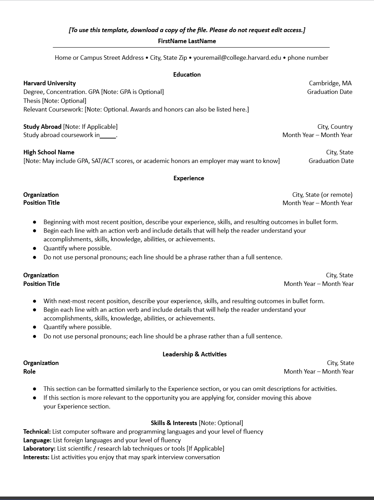
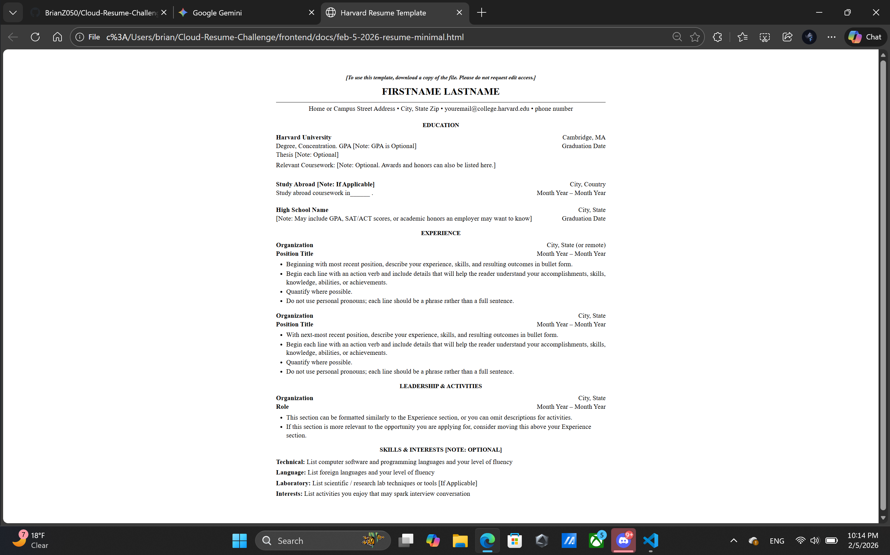

# Frontend Technical Specification

- Create a static website that serves an HTML resume. 

## Resume Format Considerations

I live in the United States, and resumes in Word/PDF format are supposed to exclude information. eg, Age, Relationship. United States resumes don't often include GPA grades. 

I'm going to use the [Harvard Resume Template format](https://careerservices.fas.harvard.edu/resources/bullet-point-resume-template/) as the basis of my resume. 

## Harvard Resume Format Generation

I know HTML quite well, so I'm going to let GenAI do the heavy lifting and generate our HTML and possible CSS, and from there I will manually refactor the code to the preferred standard. 

Prompt to Gemini 3:

``` text
Convert this resume format into HTML.
Please don't use a CSS framework.
Please use the least amount of CSS tags. 
```

Image provided to LLM:


This is the [generated output](./docs/feb-5-2026-resume-minimal.html), which I will tweak.

This is what the generated HTML looks like unaltered: 



## HTML Adjustments

- UTF-8 will support most languages. I plan to use English, so I'll leave this meta tag in. 
- Because I will be applying mobile styling to my website, I'll include the viewport meta tag width=device-width so mobile styling scales normally. 
- I'll extract out styles into its own stylesheet after I am happy with my HTML markup.
- I'll simplify my HTML makeup CSS selector to be as minimal as possible. 
- For the HTML page, I'll use soft tabs 4 spaces because I am currently learning Python in my cs courses, and that's the standard tab format. 
